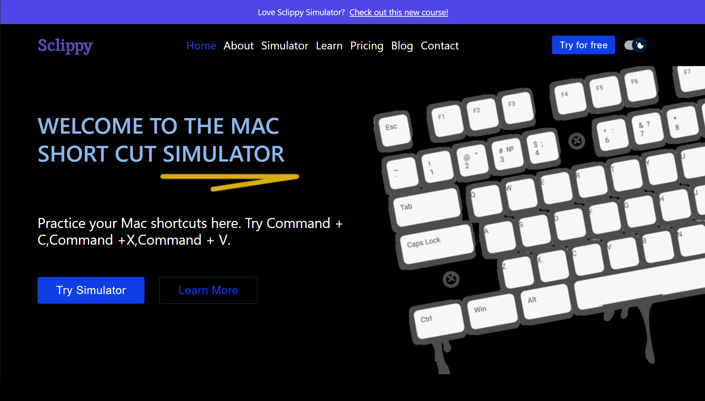
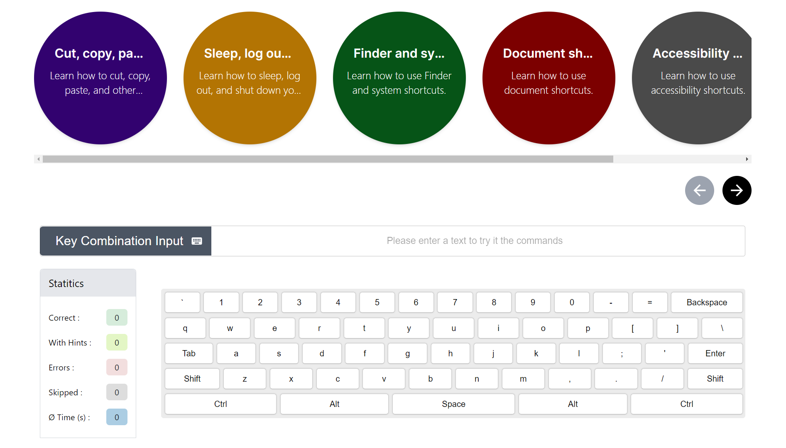

# Hi There, I'm Muhammad Bilal 👋

I am a Full Stack Web and Mobile App Developer with 5+ years of experience building real-world, production-ready applications for startups and growing businesses. I specialize in designing, developing, and scaling modern web platforms using React, Next.js, TypeScript, PostgreSQL, Firebase, and modern frontend tooling.

My work focuses on clean architecture, performance, and long-term maintainability. I care deeply about writing readable, well-structured code that scales with product growth rather than breaking under it. I’ve worked on products from early MVP stages to production systems with real users, where reliability, performance, and clear ownership matter.

I’m comfortable owning features end-to-end — from UI/UX implementation and frontend architecture to API integration and data modeling. I collaborate closely with designers, founders, and product teams to ensure what ships matches the original intent and business goals, not just the spec.

I avoid “prompt and polish” development. I use modern tools to move faster where they make sense, but critical decisions around system design, performance, and data integrity are always made deliberately. My goal is to build software that is easy to extend, easy to maintain, and trusted in production.

---

## 📊 GitHub Analytics

  

---

## 🌐 SaaS & Production Platforms

### 🚀 SmartlyQ — AI Marketing Automation Platform
🔗 https://smartlyq.com

SmartlyQ is a production SaaS platform built for AI-powered marketing automation.  
I worked on this product from the ground up:

- Designer designed complete UI/UX flows in **Figma**
- Implemented pixel-perfect frontend
- Wrote clean, original, maintainable code (no AI-generated glue code)
- Focused on performance, scalability, and real-user constraints
- Worked directly with the founder and product stakeholders

This project required real engineering discipline and strong design-to-code execution.

---

### 🎓 StudyLinker — Online Education & Tutoring Platform
🔗 https://studylinker.academy  

StudyLinker is an education marketplace connecting students with qualified teachers.

My work includes:
- Frontend architecture and responsive UI
- Next.js implementation
- Performance optimization
- Iterative collaboration on product structure and flows

Built for real users and long-term growth.

---

## 🌟 Full Stack Development Blog

Mastering CRUD operations in any tech stack and database equips a developer to build and scale large applications effectively. This foundational knowledge is crucial for success in developing robust and scalable software solutions.

📖 **Full Stack Dev Blog**  
https://www.linkedin.com/newsletters/databases-are-not-difficult-6945124839913320448/

If you find my articles helpful, please subscribe to my LinkedIn newsletter:  
**DATABASES ARE NOT DIFFICULT**

### Featured Articles
1. Next JS + Cassandra DB Todo App  
   https://www.linkedin.com/newsletters/databases-are-not-difficult-6945124839913320448/
2. Next JS + Redis Todo App  
   https://www.linkedin.com/pulse/how-develop-todo-app-next-js-redis-database-from-scratch-bilal
3. Real Time Chat App With Redis And Next JS  
   https://www.linkedin.com/pulse/how-develop-realtime-chat-app-using-redisjson-next-js-muhammad-bilal/
4. Using App Router in NextJS the right way to achieve SSR always  
   https://www.linkedin.com/pulse/using-app-router-nextjs-right-way-achieve-ssr-always-muhammad-bilal-sw8ye/

---

## 🛠️ Technologies I Use Often

- React / Next.js (App Router, SSR)
- TypeScript / JavaScript
- PostgreSQL / MongoDB / Firebase
- Node.js / FastAPI / Django
- Tailwind CSS / Material UI
- GraphQL
- React Native
- Go

---

## 🤝 Design & Figma Collaboration

I work extensively with designers who design in **Figma** and collaborate closely with designers and stakeholders:

- Reviewing layouts before development
- Refining spacing, components, and interactions
- Catching UX and implementation issues early
- Ensuring the shipped product matches design intent exactly

Most Figma files are client-owned and private, but I regularly walk teams through designs live and iterate transparently.

---

## 🚀 Projects

### ✅ Chemical Distribution Company Website  
🔗 https://harris-and-ford.vercel.app/

  

    

  

---

### ✅ TaskEncher – Project Management Software  
🔗 https://taskencher.com/

  

    

    

    

    

    

    

  

---

### ✅ Construction Company Website  
🔗 https://alumtec.ca/

  

    

  

---

### ✅ Sclippy Web App  
🔗 https://sclippy.com/  
🔗 https://github.com/bilalmohib/sclippy

  

    

    

    

    

    

    

    

  

## 📞 Contact
- LinkedIn: https://www.linkedin.com/in/bilalmohib
- GitHub: https://github.com/bilalmohib

---

### ✨ Quote
> "If you ever face a problem, start traveling with the problem until the problem gives up. But you shouldn't. Congratulations, you solved your problem."

## 📞 Hire Me for your next MVP Development
If you're a founder or business owner looking to build a **production-ready MVP or scalable SaaS**, I can help you move fast without cutting corners.

I specialize in:
- MVPs that scale
- Clean, original code (no “prompt and polish”)
- Design-to-code execution
- Long-term maintainable systems

🔗 **Upwork Profile (Hire Me):**  
https://www.upwork.com/freelancers/~013a136c7081592898
